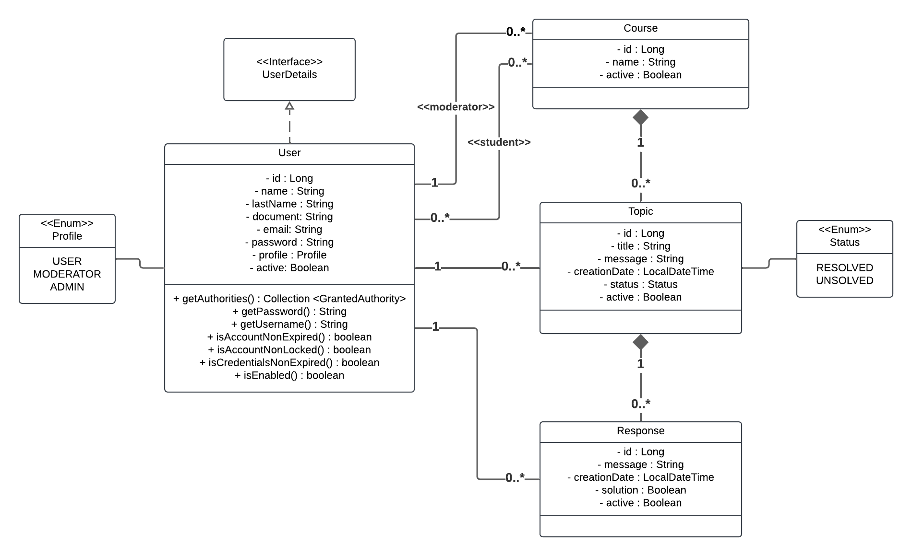
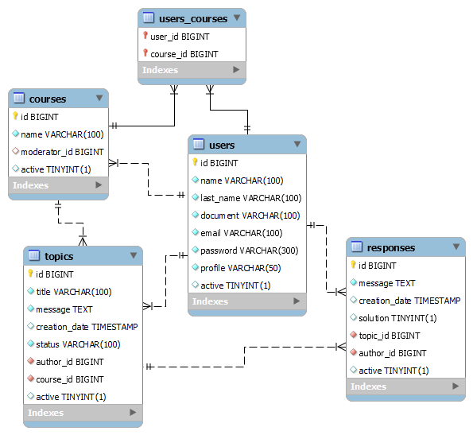

# 🗨️ Academic Forum API

**Academic Forum API** es una API RESTful construida con Java y Spring Boot para gestionar foros académicos en cursos virtuales. Incorpora autenticación JWT, control de acceso por roles (USER, MODERATOR, ADMIN) y gestión completa de cursos, tópicos y respuestas.


## 📌 Índice

1. [Descripción general](#descripción-general)  
2. [Diagrama de clases UML](#diagrama-de-clases-uml)
3. [Diagrama Entidad-Relación (ERD)](#diagrama-entidad-relación-erd)  
4. [Funcionalidades principales](#funcionalidades-principales)  
5. [Instalación y ejecución](#instalación-y-ejecución)  
6. [Swagger y documentación](#swagger-y-documentación)  
7. [Contribuciones](#contribuciones)  
8. [Agradecimientos](#agradecimientos)


## 📖 Descripción general

Academic Forum API es una aplicación RESTful desarrollada con Java 17 y Spring Boot, orientada a gestionar un foro académico dentro del contexto de cursos virtuales. El sistema permite la interacción entre usuarios mediante la creación y participación en tópicos de discusión, promoviendo el intercambio de conocimiento de forma estructurada y segura.

Cuenta con un modelo de roles claramente definido:

- 👤 **USER**: Estudiante que participa en cursos y puede crear tópicos y respuestas.
- 🧑‍🏫 **MODERATOR**: Responsable de supervisar cursos asignados y moderar las actividades del foro.
- 🛡️ **ADMIN**: Tiene control total sobre usuarios, cursos y contenido.

Características destacadas:

- Seguridad basada en JWT, con protección de rutas y control de acceso por rol.
- Reglas de negocio aplicadas por perfil de usuario, garantizando integridad y permisos correctos.
- Baja lógica de recursos como cursos, tópicos y respuestas, manteniendo trazabilidad.
- Documentación interactiva con Swagger, facilitando el uso y prueba de los endpoints de la API.


## 📦 Diagrama de clases UML

Muestra la relación entre las entidades del dominio y cómo están modeladas en el backend:




## 🗃️ Diagrama Entidad-Relación (ERD)

Representa la estructura de la base de datos MySQL, sus tablas y relaciones:




## 🚀 Funcionalidades principales

- **🔐 Autenticación y control de acceso**
  - Autenticarse mediante JWT para acceder a recursos protegidos.
  - Autorizar accesos según el perfil: `USER`, `MODERATOR` o `ADMIN`.
  - Proteger endpoints sensibles con restricciones por rol.

- **👥 Gestión de usuarios**
  - Registrar nuevos estudiantes (USER) de forma pública.
  - Registrar moderadores (MODERATOR) desde un endpoint exclusivo para administradores.
  - Validar unicidad de email y formato de documento al momento del registro.

- **📚 Gestión de cursos**
  - Crear nuevos cursos con asignación de moderadores (ADMIN).
  - Agregar estudiantes a cursos (MODERATOR o ADMIN).
  - Realizar baja lógica de cursos (ADMIN).
  - Validar que el moderador esté autorizado a operar sobre sus cursos.

- **🗨️ Gestión de tópicos**
  - Crear tópicos dentro de un curso al que se esté inscrito o se modere.
  - Listar tópicos de todos los cursos asociados al usuario (filtrables por curso).
  - Actualizar título o mensaje del tópico si se es el autor.
  - Eliminar lógicamente un tópico según permisos del rol (autor, moderador del curso, o admin).
  - Incluir respuestas asociadas en cada tópico listado o consultado.

- **💬 Gestión de respuestas**
  - Responder a tópicos si el usuario tiene acceso al curso correspondiente.
  - Marcar o desmarcar una respuesta como solución (solo autores del tópico, moderadores o admin).
  - Garantizar que solo una respuesta por tópico pueda estar marcada como solución.
  - Eliminar lógicamente respuestas según permisos de rol.
  - Sincronizar automáticamente el estado del tópico (RESOLVED / UNSOLVED) según las respuestas marcadas.

## ⚙️ Instalación y ejecución

1. **Clonar el repositorio**
    ```bash
    git clone https://github.com/javote94/foro.git
    ```

2. **Configuración de la base de datos y sus propiedades**

    Crear el archivo `application.properties` en el directorio `src/main/resources` y define las siguientes propiedades:
    
    ```properties
    # src/main/resources/application.properties

    # Nombre de la aplicación (opcional)
    spring.application.name=foro

    # Configuración de la base de datos
    spring.datasource.url=jdbc:mysql://localhost:3306/foro
    spring.datasource.username=your_username
    spring.datasource.password=your_password
    spring.datasource.driver-class-name=com.mysql.cj.jdbc.Driver

    # Configuración de Flyway (migraciones)
    spring.flyway.enabled=true
    spring.flyway.locations=classpath:db/migration
    
    # Configuración de seguridad (clave JWT)
    api.security.secret=your_secret_key
    ```

3. **Requisitos previos**
   - ☕ Java JDK 17

   - 🐬 MySQL 8+. Crea una base de datos llamada `foro`.

   - 💻 IntelliJ IDEA (recomendado)

4. **Ejecución del proyecto**
    - Abre el proyecto con IntelliJ IDEA.
    - Ejecuta la clase `ForohubApplication` para iniciar la aplicación.


## 📚 Swagger y documentación

Una vez levantada la aplicación en el servidor local, accede a la documentación interactiva desde:

🔗 [`http://localhost:8080/swagger-ui.html`](http://localhost:8080/swagger-ui.html)

Allí podrás:
- Probar los endpoints
- Ver las estructuras JSON esperadas
- Autenticarse con JWT


## 🧪 Usuarios de prueba

La base de datos inicial incluye usuarios predefinidos con distintos roles, útiles para probar la autenticación y las funcionalidades protegidas:

| Email                      | Password | Rol       | Descripción                               |
|----------------------------|----------|-----------|-------------------------------------------|
| `michaelsmith@mail.com`    | 123456   | USER      | Estudiante inscrito en Java y Python      |
| `emilyjohnson@mail.com`    | abcdef   | USER      | Estudiante inscrito solo en Java          |
| `jameswilliams@mail.com`   | 123abc   | USER      | Estudiante inscrito solo en Python        |
| `oliviabrown@mail.com`     | 654321   | USER      | Estudiante en ambos cursos                |
| `williamjones@mail.com`    | xyz123   | USER      | Estudiante inscrito solo en Python        |
| `sophiagarcia@mail.com`    | pass12   | USER      | Estudiante inscrito solo en Java          |
| `danielmartinez@mail.com`  | qwerty   | USER      | Estudiante inscrito en Python             |
| `gracedavis@mail.com`      | zxcvbn   | USER      | Estudiante en ambos cursos                |
| `henrywilson@mail.com`     | 112233   | MODERATOR | Moderador asignado a ambos cursos         |
| `alicetaylor@mail.com`     | admin1   | ADMIN     | Administradora del sistema                |

> 📌 **Importante**: Todos los usuarios están activos y pueden autenticarse usando el endpoint `/login` para obtener su token JWT.

## 🤝 Contribuciones
Este proyecto está en preparación. Cualquier feedback es bienvenido y si estás interesado en contribuir, estamos abiertos a pull requests o puedes [abrir un issue](https://github.com/javote94/forohub/issues) para discutir posibles cambios.

## 🎓 Agradecimientos
Esta proyecto fue desarrollado en el marco del programa **Oracle Next Education** junto a **Alura Latam**. Mis agradecimientos a estas organizaciones por proporcionar el contexto educativo y los recursos necesarios para el desarrollo del proyecto.

---

> Desarrollado por [Javier Rameri](https://github.com/javote94)